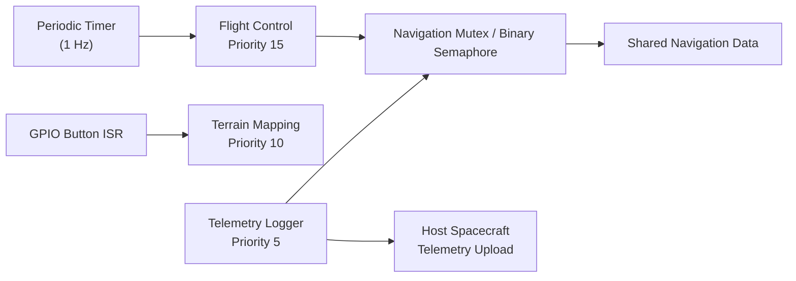

# Martian Drone — Real-Time Systems Final Capstone

## One sentence
A flight control system that handles priority inversion, built to demonstrate the importance of proper mutex implementation in an
aerospace embedded system.

## Demo
- Video: <YouTube>
- Live Wokwi: ABEL-FINAL-RTS26Summer https://wokwi.com/projects/470739744054261761

## Architecture

The system consists of three FreeRTOS tasks coordinated through a shared navigation resource protected by either a mutex or a binary semaphore. A periodic timer releases the Flight Control task each second, while a GPIO interrupt wakes the Terrain Mapping task on demand. The Flight Control and Telemetry Logger tasks both require access to the shared navigation data, allowing the effects of priority inheritance on task response time to be observed.

## Tasks & timing (WCET evidence)
|     Task        | Period T   | WCET C   | U=C/T    | Priority | Deadline |
|Flight Controller|  1000 ms   | 24.65 ms | 0.025    |    15    |  300 ms  |
|Terrain Mapper   |User-Defined| ~3000 ms | Variable |    10    |  Soft    |
|Telemetry Logger |  ~550 ms   | 421.0 ms | 0.765    |    5     | 1000 ms  |

Total utilization U = 0.80  (RM bound / EDF feasible: Below RM bound when Terrain Mapper is omitted. EDF feasible for Terrain Mapper Period < ~15 seconds.)

## Hazard analysis & standard mapping

| Hazard | Effect | Mitigation | Standard / Practice Mapping |
|--------|--------|------------|-----------------------------|
| Priority inversion between Flight Control and Telemetry Logger | High-priority control task experiences excessive blocking, potentially delaying attitude corrections | Use a FreeRTOS mutex with priority inheritance to bound blocking time | DO-178C: deterministic timing analysis and verification of safety-critical software behavior |
| Shared resource contention | Multiple tasks competing for navigation data may increase response time or cause unpredictable execution delays | Protect shared resources with ownership-aware synchronization primitives and minimize critical sections | NASA software engineering practices: controlled resource sharing and predictable execution |
| Excessive execution time from Terrain Mapping task | CPU-intensive processing can interfere with time-critical tasks | Assign appropriate task priorities and analyze WCET/response time under worst-case loading conditions | Real-time systems practice: WCET analysis and schedulability verification |
| Missed Flight Control deadline | Delayed control updates could reduce vehicle stability or responsiveness | Measure response time, verify deadlines, and ensure synchronization mechanisms provide bounded delays | DO-178C concepts: timing requirements verification and robustness analysis |
| Incorrect synchronization primitive selection | Binary semaphore allows priority inversion because it lacks task ownership and priority inheritance | Replace semaphore-based locking with a mutex when resource ownership and inheritance are required | FreeRTOS design guidance: mutexes for shared resources requiring priority inheritance |

## Graceful degradation

The system is designed to maintain critical flight operations even when
non-critical processing tasks experience delays.

| Failure Condition | Detection Method | System Response |
|-------------------|------------------|-----------------|
| Terrain Mapping task consumes excessive CPU time | Response-time measurements and task timing monitoring | Flight Control maintains highest priority and continues execution; terrain processing may be delayed |
| Telemetry Logger is blocked by resource contention | Mutex acquisition delay monitoring | Priority inheritance temporarily elevates the Telemetry Logger priority so the shared resource is released sooner |
| Navigation resource unavailable | Flight Control detects delayed mutex acquisition | Flight Control waits for bounded resource access rather than allowing uncontrolled priority inversion |
| Non-critical mapping operation fails or is delayed | Task timeout or missing completion signal | Continue flight control and telemetry functions while postponing surface analysis updates |

The system prioritizes vehicle stability and control over non-critical
functions. If computationally expensive Terrain Mapping operations cannot
complete within their expected timing constraints, the system allows those
operations to degrade while preserving the Flight Control task's ability to
respond to disturbances.

## Build & run
<toolchain, board, how to reproduce>
Wokwi online compiler, using ESP32-S3 board. Using the Wokwi link provided, either compile and run the project in your browser, or copy the project then run it in your browser (if you would like to make edits to the project).
If using the source code provided in GitHub, make a new Wokwi project with the ESP32-S3 board, add the main.c file and the diagram.json file, and run.

## Tailored for
**Aerospace embedded firmware roles** — The project uses an aerospace
flight-control scenario to demonstrate deterministic execution,
resource-sharing analysis, hazard identification, and mitigation strategies
similar to those used in safety-critical systems.
